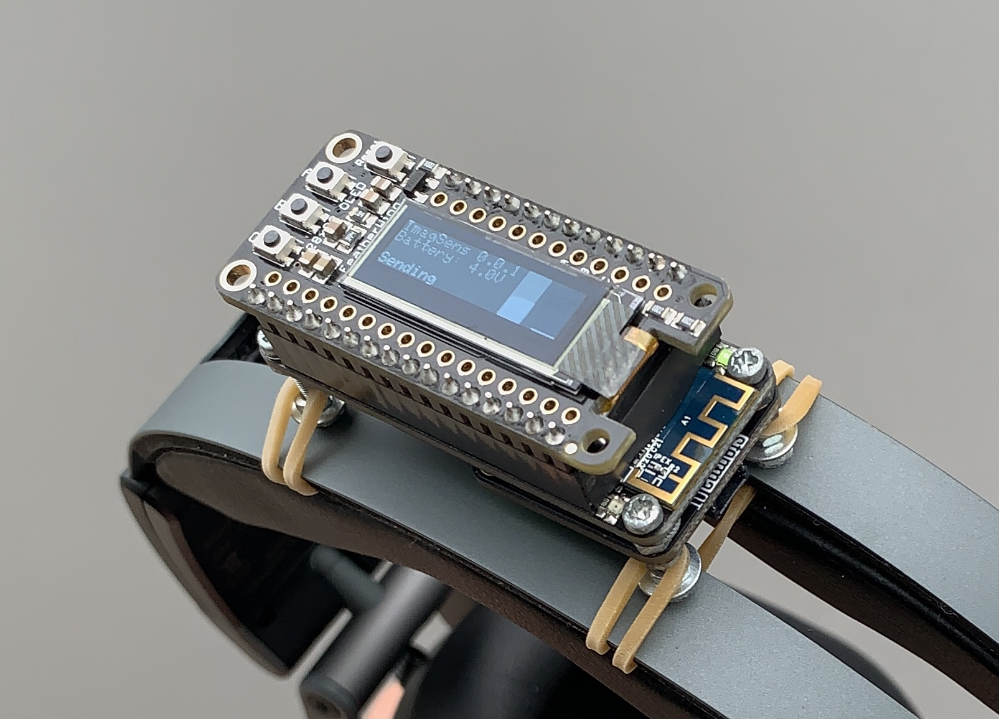

Sonic Imagination - Sensor Firmware
===================================

Firmware for Imagination wireless head tracking sensor.

<!-- markdown-toc start - Don't edit this section. Run M-x markdown-toc-refresh-toc -->
**Table of Contents**

- [Sonic Imagination - Sensor Firmware](#sonic-imagination---sensor-firmware)
- [Use](#use)
    - [Wireless connection](#wireless-connection)
    - [OSC communication protocol](#osc-communication-protocol)
    - [Wired connection (USB MIDI)](#wired-connection-usb-midi)
    - [Button actions](#button-actions)
    - [Calibration procedure](#calibration-procedure)
- [Build](#build)
    - [Hardware](#hardware)
    - [Library dependencies](#library-dependencies)
    - [Version history](#version-history)

<!-- markdown-toc end -->

# Use

## Wireless connection

The sensor acts as a wireless access point. The default network SSID is *imagination,* default password is *atmospheres*. The sensor will offer an IP address to the client via DHCP.

After successful connection, the sensor starts streaming the orientation data to the client. Only one client can be connected at a time.

## OSC communication protocol

The orientation data is sent using [OSC (OpenSoundControl)](https://opensoundcontrol.org). Currently, the only message type is `/rot x y z w` (4 floats), which sends the orientation as a quaternion.

## Wired connection (USB MIDI)

When connected to a host via USB, the sensor appears as a MIDI device. The orientation quaternion components are sent as 14-bit controller values using controller numbers 16/48 (w), 17/49 (x), 18/50 (y), 19/51 (z).

The MIDI data is compatible with the IEM [MrHeadTracker](https://git.iem.at/DIY/MrHeadTracker/-/wikis/home) DIY sensor and works fine with the [IEM Plug-in Suite](https://plugins.iem.at/). You may have to switch the orientation convention, see section [Button actions](#button-actions) below.

## Button actions

Refers to the buttons on the Featherwing OLED peripheral board.

- **A** Toggle display enablement. In any case, display will be switched off after 30 seconds (powersave).
- **B** Custom north
  + _Short press:_ Set custom north (current front direction will become the new north reference).
  + _Long press:_ Reset to magnetic north.
- **C** Orientation conventions and calibration
  + _Short press:_ Cycle through orientation conventions, e.g. _std_ (Imagination) or _iem_ ([MrHeadTracker](https://git.iem.at/DIY/MrHeadTracker/-/wikis/home) compatibility).
  + _Long press:_ Enter calibration mode.
  + When in calibration mode:
    * _Short press:_ Save calibration and leave calibration mode.
    * _Long press:_ Discard calibration and leave calibration mode (previous calibration will remain active).

## Calibration procedure

Calibration procedure according to the [BNO08x sensor documention](https://www.ceva-dsp.com/resource/bno080-bno085-sesnor-calibration-procedure/):

- Enter calibration mode (long-press button C)
- Place the sensor stable and immobile for a few seconds, e.g., by putting on a table (gyroscope calibration)
- Place the sensor in 4..6 different, distinct directions and leave immobile for some seconds, e.g., the six plane areas of a cuboid (accelerometer calibration)
- Rotate the sensor around different axes evenly by 180 degrees and back over approx. 2 sec. per way (magnetometer calibration)
- The reliability measure displayed in the rightmost bar should become as high as possible
- Save calibration (short-press button C)

The calibration settings will be persistent across power cycles.

# Build

## Hardware

The current prototype is made of
- [Adafruit Feather M0 WiFi](https://www.adafruit.com/product/3010) (SAMD21 + ATWINC1500)
- [Adafruit BNO085 IMU Fusion Breakout](https://www.adafruit.com/product/4754) (I2C connected)
- [Adafruit Featherwing OLED 128x32](https://www.adafruit.com/product/3045) (Display and button I/O)

## Library dependencies

The firmware can be compiled using the Arduino IDE.

Please refer to the respective Adafruit documentation for installing the board files and support libraries:
- [Feather M0 WiFi](https://learn.adafruit.com/adafruit-feather-m0-wifi-atwinc1500)
- [BNO085 IMU](https://learn.adafruit.com/adafruit-9-dof-orientation-imu-fusion-breakout-bno085)
- [Featherwing OLED](https://learn.adafruit.com/adafruit-oled-featherwing)

Additionally, the following libraries are used (installable via Arduino library manager):
- [LiteOSCParser](https://github.com/ssilverman/LiteOSCParser)
- [MIDIUSB](https://www.arduino.cc/en/Reference/MIDIUSB)
- [EasyButton](https://easybtn.earias.me/)
- ~~[Arduino Low Power](https://www.arduino.cc/en/Reference/ArduinoLowPower)~~ (currently not used)

Finally, this library needs to be installed manually (copied/checked out to Arduino libraries directory):
- [Arduino-Helpers](https://github.com/tttapa/Arduino-Helpers) (Quaternion implementation)

## Version history

- _0.1.0_ initial release
